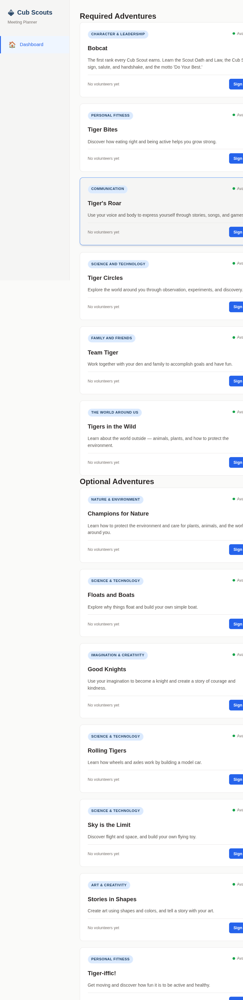

# cub-scouts

A meeting planner for Cub Scout den leaders. Browse your rank's adventures, pick
activities for each requirement, sign up to run a meeting, and generate a printable
meeting plan powered by a local LLM.



## Features

- Password-gated — one shared den password, no accounts to manage.
- 6 required + 8 elective Tiger adventures with per-requirement activity choices.
- Parent sign-ups stored as JSON on disk. No database.
- LLM-generated meeting plans via any OpenAI-compatible endpoint (llama.cpp, Ollama,
  LM Studio, or a hosted API). Everything else works without one.
- Guided 3-step wizard: pick activities, review and sign up, generate a plan.
- Docker support for deployment.

## Tech stack

Vanilla TypeScript SPA (Vite, hash routing, no framework) plus a thin Express API server.
Vitest for tests (12). No build-time dependencies beyond Vite and TypeScript.

## Setup

Requires Node 22+.

```bash
npm install
cp config.example.json config.json
```

Edit `config.json`:

| Key | What |
|-----|------|
| `password` | Shared den password for the login gate |
| `llmBaseUrl` | Any OpenAI-compatible chat completions URL |
| `llmApiKey` | API key for that endpoint |
| `llmModel` | Model name to request |

## Run

```bash
npm run dev        # Vite dev server + API on port 3001
npm run build      # compile and bundle into dist/
npm start          # run the production build
npm test           # 12 tests
npm run typecheck  # both tsconfigs
```

Docker: `docker compose up --build` (needs `config.json` in the build context).

## License

MIT — see [LICENSE](LICENSE).
